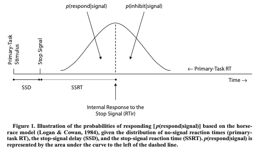

# Data Manual - R01: Food and Brain Study

1. [Data Manual - R01: Food and Brain Study](#data-manual---r01-food-and-brain-study)
2. [Introduction](#introduction)
   1. [Overview of Study](#overview-of-study)
   2. [Inclusion/Exclusion Criteria](#inclusionexclusion-criteria)
3. [Study Design](#study-design)
   1. [Visit 1](#visit-1)
   2. [Visit 2](#visit-2)
   3. [Visit 3](#visit-3)
   4. [Visit 4](#visit-4)
   5. [Visit 5](#visit-5)
   6. [Visit 6](#visit-6)
   7. [Visit 7](#visit-7)
4. [Outcome Measures: Descriptions and Protocols](#outcome-measures-descriptions-and-protocols)
   1. [Laboratory Eating Paradigms](#laboratory-eating-paradigms)
      1. [Standard Laboratory Meal](#standard-laboratory-meal)
      2. [Eating in the Absence of Hunger](#eating-in-the-absence-of-hunger)
      3. [Portion Size Meals](#portion-size-meals)
   2. [Anthropometrics](#anthropometrics)
      1. [Height and Weight](#height-and-weight)
      2. [Dual-Energy X-Ray Absorptiometry (DXA)](#dual-energy-x-ray-absorptiometry-dxa)
   3. [Actigraphy](#actigraphy)
   4. [Go-No Go](#go-no-go)
      1. [Task Design](#task-design)
      2. [Outcomes of Interest](#outcomes-of-interest)
   5. [Letter N-Back](#letter-n-back)
      1. [Task Design](#task-design-1)
      2. [Outcomes of Interest](#outcomes-of-interest-1)
   6. [Food Stop-Signal Task](#food-stop-signal-task)
      1. [Task Design](#task-design-2)
      2. [Outcomes of Interest](#outcomes-of-interest-2)
   7. [Reward-Related Decision-Making (Space Game)](#reward-related-decision-making-space-game)
      1. [Task Design](#task-design-3)
      2. [Outcomes of Interest](#outcomes-of-interest-3)
   8. [Functional Magnetic Resonance Imaging](#functional-magnetic-resonance-imaging)
      1. [Mock-Scan Protocol](#mock-scan-protocol)
      2. [Resting State](#resting-state)
      3. [Structural](#structural)
      4. [Functional - Food Images](#functional---food-images)
      5. [Food Image Ratings](#food-image-ratings)
   9. [WASI](#wasi)
   10. [Delay of Gratification](#delay-of-gratification)
   11. [Child-Reported Questionnaires](#child-reported-questionnaires)
      1. [Child Weight Concerns](#child-weight-concerns)
      2. [Children's Body Image Scale (CBIS)](#childrens-body-image-scale-cbis)
      3. [Community Childhood Hunger Identification Project](#community-childhood-hunger-identification-project)
      4. [Communities That Care](#communities-that-care)
   12. [Parent-Reported Questionnaires](#parent-reported-questionnaires)
      1. [Alcohol Use Disorders Identification Test (AUDIT)](#alcohol-use-disorders-identification-test-audit)
      2. [Behavioral Inhibition System/Behavioral Activation System (BIS/BAS)](#behavioral-inhibition-systembehavioral-activation-system-bisbas)
      3. [Behavioral Rating Inventory of Executive Function-2 (BRIEF-2)](#behavioral-rating-inventory-of-executive-function-2-brief-2)
      4. [Binge Eating Scale (BES)](#binge-eating-scale-bes)
      5. [Child Behavior Questionnaire (CBQ) - Short Form Version 1](#child-behavior-questionnaire-cbq---short-form-version-1)
      6. [Child Feeding Quesstionnaire (CFQ)](#child-feeding-quesstionnaire-cfq)
      7. [Children's Eating Behavior Quesstionnaire (CEBQ)](#childrens-eating-behavior-quesstionnaire-cebq)
      8. [Children's Sleep Habits Questionnaire - Abreviated (CSHQ-A)](#childrens-sleep-habits-questionnaire---abreviated-cshq-a)
      9. [Child Feeding Quesstionnaire (CFQ)](#child-feeding-quesstionnaire-cfq-1)
      10. [Family Food Behvior Survey (FFBS)](#family-food-behvior-survey-ffbs)
      11. [Household Food Insecurity Access Scale (HFIAS)](#household-food-insecurity-access-scale-hfias)
      12. [US Household Food Security Survey Module: Three Stage (HFSSM)](#us-household-food-security-survey-module-three-stage-hfssm)
   13. [Data Management](#data-management)
      1. [Directory Organization](#directory-organization)
      2. [Data Processing Pipeline](#data-processing-pipeline)
      3. [Data Quality Control](#data-quality-control)
      4. [Data Documentation](#data-documentation)
      5. [Pre-Processing Pipeline](#pre-processing-pipeline)
   14. [Interactive Reports and Tables](#interactive-reports-and-tables)
   15. [Analyses: Guidelines for Reproducibility and Documentation](#analyses-guidelines-for-reproducibility-and-documentation)

# Introduction

## Overview of Study

  Reducing intake from large food portions is of critical importance to preventing obesity. People consistently eat more when they are served larger portions, a phenomenon known as the portion size effect. The mechanisms of the portion size effect are not well understood, and investigating the underlying neurobiology that drives this phenomenon may inform the development of more effective obesity prevention programs. The proposed research will follow healthy weight children who vary by family risk for obesity to identify the neurobiological and appetitive traits that are implicated in overeating and weight gain during the critical pre-adolescent period. Our central hypothesis is that increased intake from large portions of energy dense foods is due in part to reduced activity in brain regions implicated in inhibitory control and decision making, combined with increased activity in reward processing pathways. 
  
  To test this hypothesis, we will recruit 7-8 year-old healthy weight children at two levels of obesity risk based on parent weight status (i.e., high-risk and low-risk).  
  * Aim 1: We will use functional magnetic resonance imaging (fMRI) to characterize neural response to food portion size and energy denisty in children with high- and low-risk for obesity. 
  * Aim 2: We will determine the relationship between neural response to visual portion size cues and measured food intake when portions are increased in the laboratory. 
  * Aim 3: We will determine the relationship between neural response to large portions and other validated measures of overeating such as  satiety responsiveness and eating in the absence of hunger. 
  * Aim 4: We will conduct follow-up visits one year after baseline to determine the extent to which baseline brain and behavioral responses to portion size predict gains in adiposity. 
  
 ## Inclusion/Exclusion Criteria

In order to be enrolled, children must be of good health based on parental self-report, have no learning disabilities or developmental delays (e.g., ADHD, Autism, dyslexia), speak English fluently, not be on any medications known to influence body weight, taste, food intake, behavior, or blood flow, not be claustrophobic, and between the ages of 7-8 years-old at enrollment The biological mother and biological father must have a body mass index either between 18.5 - 25 kg/m2 (low-risk group) or greater than or equal to 30 kg/m2 for mothers and  greater than or equal to 25 kg/m2 for fathers  (high-risk group) and must be available to attend the visits with their child.

Children would be excluded if they are not within the age requirements (< than 7 years old or > than 8 years-old at baseline). Children will be excluded if they are taking cold or allergy medication, or other medications known to influence cognitive function, taste, appetite, or blood flow. Children will be excluded if they are red/green colorblind or if they do not speak English fluently. Children will be excluded if they report being claustrophobic, or if they have any of the following: a learning disability, ADD/ADHD, language delays, autism, dyslexia, a pre-existing medical condition such as type I or type II diabetes, rheumatoid arthritis, Cushing’s syndrome, Down’s syndrome, food allergies, severe lactose intolerance, Prader-Willi syndrome, HIV, cancer, renal failure, or cerebral palsy. Children will be excluded if they have tattoos, permanent makeup, dental ware, pacemakers, or metal implants that would preclude safe completion of the MRI. Furthermore, children will be excluded if they have receivedan X-ray in the previous month (to avoid excess radiation exposure due to the DXA scans performed in the research). Families will be excluded if the biological mother/father has a body mass index < 18.5 kg/m2 or between 25-29.9 kg/m2 for mothers. Children will be excluded if their BMI is not below the 90th percentile at the first visit.  Families will also be excluded if the primary parent in charge of making feeding decisions is unable to attend the study visits, or if the family reports plans to move away from the area in the next year

* Note: due to COVID enrollement challenges, inclusion criteria have been widened to allow inclusion of children whose biological mother has body mass index between 18.5 - 25 kg/m2 (low-risk group) or greater than 30 kg/m2 (high-risk group), regardless of biological father's body mass index

# Study Design

This study includes 7 laboratory vists. The 6 'baseline' visits will occur 1 week apart and the final 7th visit will occure 1 year after the first visit.

## Visit 1

The first visit takes place in Noll Lab. During the visit, the parent and child complete consent and assent, respectively. The children compelte a Dual-Energy X-Ray Absorptiometry (DXA) scan prior to a [standard laboratory meal](#) and the [Eating in the Absence of Hunger (EAH)](#) protocol. Eating paradigms are video recorded to code [meal microstructure](#) and [EAH behaivor](#). The children also rate their fullness using [Freddy Fullness](#) and [liking](#) and [wanting](#) of foods. Both parents and chidlren also complete questionnaires on Qualtrics.

Child Measures:
* [Height and Weight](#anthropometrics)
* [Dual-Energy X-Ray Absorptiometry (DXA)](#anthropometrics)
* [Standard Laboratory Test Meal](#)
* [Eating in the Absence of Hunger (EAH)](#)
* [Portion Size Discrimination](#)
* [Portion Size Selection](#)

Parent Measures:
* [Height and Weight](#anthropometrics)
* [Demographics Quesstionnaire](#)
* [Pubertal Development Scale](#)
* [Tanner Scale](#)
* [Physical Activity Questionnaire](#)
* [Portion Size Selection](#)
* [Portion Size Feeding Strategies](#)

## Visit 2

The second visit takes place in Chandlee Laboratory. During the visit, the consumes one of the [portion size meals](#), which is video recorded to code [meal microstructure](#). The children also rate their fullness using [Freddy Fullness](#) and [liking](#) of foods. In addition to the meal, children complete the [Go-NoGo task](#) and both parents and chidlren also complete questionnaires on Qualtrics. Lastly, the child is trained on how to wear an [actigraph watch](#) and given one to wear for 1 week (to be returned on [Visit 3](#visit-3))

Child Measures:
* [Portion Size Meal](#)
* [Go-NoGo Task](#go-no-go)
* ['Space Game'](#reinforcement-learning-space-game)
* [Kid's Food Questionnaire](#)
* [Tempest Self-Regulation Questionnaire - Eating](#)
* [Revised Children's Manifest Anxiety Scale](#)

Parent Measures:
* [Child Beahvior Questionniare](#)
* [Children's Eating Behavior Questionnaire](#)
* [Child Feeding Questionnaire](#)
* [Binge Eating Scale](#)
* [Family Food Beahvior Scale](#)
* [Children's Sleep Habbits Questionniare - Abreviated](#)

## Visit 3

The third visit takes place in Chandlee Laboratory. During the visit, the consumes one of the [portion size meals](#), which is video recorded to code [meal microstructure](#). The children also rate their fullness using [Freddy Fullness](#) and [liking](#) of foods. In addition to the meal, children complete the [N-Back Task](#) and both parents and chidlren also complete questionnaires on Qualtrics. Lastly, the child returns the [actigraph watch](#).

Child Measures:
* [Portion Size Meal](#)
* [N-Back Task](#letter-n-back)
* [Delay Discounting Questionnaire for Children](#)

Parent Measures:
* [Lifestyle Beahvior Checklist](#)
* [Sensitivity to Punishment/Sensitivity to Reward Questionnaire](#)
* [Behavioral Inhibition System/Behavioral Activation System](#)
* [Parent Weight-Loss Beahviors](#)
* [Three-Factor Eating Questionnaire](#)

## Visit 4

The fourth visit takes place in Chandlee Laboratory. During the visit, the consumes one of the [portion size meals](#), which is video recorded to code [meal microstructure](#). The children also rate their fullness using [Freddy Fullness](#) and [liking](#) of foods. In addition to the meal, children complete an [IQ assessment](#) and the ['Space Game'](#reinforcement-learning-space-game), which is a two-stage reinforcement learning task. Both parents and chidlren also complete questionnaires on Qualtrics. Lastly, the child completes a [mock-scan protocol](#) to become familiar with the scanner.

Child Measures:
* [Portion Size Meal](#)
* [IQ](#)
* ['Space Game'](#reinforcement-learning-space-game)
* [Child Weight Concerns](#)
* [Children's Body Image Scale](#childrens-body-image-scale-cbis)
* [Parent Responsiveness Index](#)

Parent Measures:
* [Household Food Security Survey Module](#)
* [Household Food Insecurity Access Scale](#)
* [Community Childhood Hunger Identification Project](#)
* [Behavioral Rating Inventory of Executive Functioning - 2](#)

## Visit 5

The fifth visit takes place in Chandlee Laboratory. During the visit, the consumes one of the [portion size meals](#), which is video recorded to code [meal microstructure](#). The children also rate their fullness using [Freddy Fullness](#) and [liking](#) of foods. In addition to the meal, children complete an [interoception](#) protocol. Both parents and chidlren also complete questionnaires on Qualtrics. Lastly, the child completes a second [mock-scan protocol](#) to become familiar with the scanner.

Child Measures:
* [Portion Size Meal](#)
* [Interoception](#)
* [Loss of Control-Eating Questionnaire](#)
* [Communities that Care - Abreviated](#)

Parent Measures:
* [Alcohol Use Disorders Identification Test](#)

## Visit 6

The sixth visit takes place in Chandlee Laboratory. During the visit, the children also rate their fullness using [Freddy Fullness](#) to ensure they are in a neutral state prior to cmpleting the (functional magnetic resonance imaging (fMRI) paradigm)[#]. If they fall below 25% fulness, they are given a snack. The children also report [state anxiety](#) before and after the fMRI protocol. After the scan, children complete [ratings of all images presented in the scanner](#), the [Food Stop-Signal Task (SST)](#food-stop-signal-task), and a [Dealy of Gratifcation protocol](#). Prior to the SST, children are given a snack they can eat so they are not hungry prior to the task.

Child Measures:
* [fMRI Protocol](#)
* [fMRI Image Ratings](#)
* [Food Stop-Signal Task](#food-stop-signal-task)
* [Delay of Gratification](#)

## Visit 7

The seventh visit takes place in Noll Laboratory 1 year after [Visit 1](#visit-1). The children compelte a Dual-Energy X-Ray Absorptiometry (DXA) scan prior to a [standard laboratory meal](#) and the [Eating in the Absence of Hunger (EAH)](#) protocol. Eating paradigms are video recorded to code [meal microstructure](#) and [EAH behaivor](#). The children also rate their fullness using [Freddy Fullness](#) and [liking](#) and [wanting](#) of foods. Children also complete the [N-Back Task](#letter-n-back) and the ['Space Game'](#reinforcement-learning-space-game). Both parents and chidlren also complete questionnaires on Qualtrics.

Child Measures:
* [Height and Weight](#anthropometrics)
* [Dual-Energy X-Ray Absorptiometry (DXA)](#anthropometrics)
* [Standard Laboratory Test Meal](#)
* [Eating in the Absence of Hunger (EAH)](#)
* [N-Back Task](#letter-n-back)
* [Loss of Control-Eating Questionnaire](#)
* [Communities that Care-Abreviated](#)
* [Pubertal Development Scale](#)
* [Tanner Scale](#)

Parent Measures:
* [Height and Weight](#anthropometrics)
* [Demographics Questionnaire](#)
* [Pubertal Development Scale](#)
* [Tanner Scale](#)
* [Physical Activity Questionnaire](#)
* [Portion Size Selection](#)
* [Children's Eating Behaivor Questionnaire](#)
* [Child Feeding Questionniare](#)
* [Children's Sleep Habits Questionnaire - Abreviated](#)
* [Behavioral Rating Inventory of Executive Functioning - 2](#)
* [Alcohol Use Disorders Identification Test](#)

# Outcome Measures: Descriptions and Protocols

## Laboratory Eating Paradigms

### Standard Laboratory Meal

### Eating in the Absence of Hunger

### Portion Size Meals

## Anthropometrics

### Height and Weight

### Dual-Energy X-Ray Absorptiometry (DXA)

## Actigraphy

## Go-No Go

Theoretical background...(brief)

### Task Design

Instructions…
12 practice trials. 5 blocks of 40 trials (30 Go/10 NoGo). Timing info… Between blocks…
Stim images...

### Outcomes of Interest

Performace on the GNG task is typicall assessed based on correct responses and errors. Correct responses are often called ‘Hits’. There are two primary errors that can occur in the GNG task. Omission errors are when the participant failed to respond to a target/go stimuli while commission errors occur when the participant response to a NoGo trial. These types of errors are often called ‘misses’ and ‘false alarms’, respectively. In addition to response correctness, reaction time is also used to look at differences between correct responses and false alarms.

Signal Detection Theory (SDT) attempts to determine thresholds at which a person can distinguish a pattern (e.g., signal) from random patterns of noise. In the context of GNG, it is a technique to assess the ability to detect the NoGo signal during the task. Below are metrics that can be used to test signal detection and the accompanying equations. Non-parametric measures were included due to the fact because it is likely that the signal and noise distributions do not meet the following assumptions: 1) both are normal; and 2) have the same SD. It is not possible to test these assumptions with Yes/No tasks like GNG. When these assumptions are not met, sensory sensitivity will vary with differing response biases. See the following paper for an explanation of the selected measures and has excellent references for further reading: (Stanislaw & Todorov, 1999).

* d’: d-prime is a parametric measure of sensory sensitivity—it is equal to the distance between the noise distribution and the signal and noise distribution

>> $d^{\prime} = \phi^{- H} - \phi^{-FA} → z(H)-z(FA)$  
H:percent hits; FA: percent false alarms; and z is derived from the normal inverse distribution

* A’: A-prime is a non-parametric measure of sensory sensitivity; generally between 0.5 - 1

>> $A^{\prime} = .5 + \frac{(H - FA)(1 + H - FA)}{4H(1 - FA)}$ when $H \ge FA$  
$A^{\prime} = .5 - \frac{(FA - H)(1 + FA - H)}{4H(1 - H)}$ when $FA \ge H$  
H: percent hits; FA: percent false alarms

* c: is a measure of bias—distance between the criterion and a neutral point where neither response is favored—the neutral point is where the signal and noise distributions overlap. Negative values correspond to bias to respond ‘yes’ (i.e., press for Go) and positive corresponds to bias to respond ‘No’

>> $c = \frac{\phi^-H + \phi^- FA)}{2} → \frac{z(H)+ z(FA)}{2}$  
 H:percent hits; FA: percent false alarms; and z is derived from the normal inverse distribution

* β’’ (Geir’s β): is a non-parametric measure of response bias—it is the ratio of the ordinate (i.e., height) of the signal and noise distribution at the criterion to the the ordinate of the noise distribution

>> $β^{\prime\prime} = \frac{H(1 - H) - FA(1 - FA)}{H(1 - H) + FA(1 - FA)}$ when $H \ge FA$  
$β^{\prime\prime} = \frac{FA(1 - FA) - H(1 - H)}{FA(1 - FA) + H(1 - H)}$ when $FA \ge H$  
H:percent hits;FA:percent false alarms

## Letter N-Back

Theoretical background...(brief)

### Task Design

Stim images...

### Outcomes of Interest

Participants’ stop-signal reaction times (SSRT) was computed using the integration method after replacing omitted go responses with the participants’ slowest go RT (Verbruggen et al., 2019). SSRT was only computed if the assumptions of the racehorse model were met (i.e., go RT > unsuccessful stop RT; Verbruggen et al., 2019). Of the children with usable resting state data, 1 participant was excluded for not meeting the assumptions of the race model, and was therefore treated as missing data and imputed in subsequent analyses.

## Food Stop-Signal Task

The stop-signal task (SST) assesses inhibitory control by measuring the latency of response inhibition. The SST was adapted from the implementation in (Verbruggen, Logan, & Stevens, 2008). For a thorough discussion of the theoretical basis for the race-horse model of response inhibition see (Verbruggen & Logan, 2009). The basic premise is that participants will first activate a go-response to a stimuli. After seeing the stop stimuli, they will activate a nogo-response. If they are successful in inhibiting the go-response, the nogo-response was faster. If they fail to inhibit the go-response, the nogo-response was too slow. In this task, inhibition can be measured by manipulating the delay of the stop signal using a step-like function to hold successful stopping at a .5 probability.

### Task Design

The SST was administered using Matlab2018b and Psychtoolbox3. Plates of food were presented with a triangle-folded napkin on either the left or right side of the plate (go stimulus; see Figure 1) for 1500 ms with an inter-stimulus-interval of 50 ms (i.e., fixation). Children were asked to sort the plates according to which side of the plate the napkin was on and to press the left or right arrow keys when the napkin appeared on the left or right side of the plate, respectively. They were encouraged to respond as quickly as possible. They were also told that the plate would be sometimes get covered with a warmer dome (i.e., stop-signal; see Figure 1) and were instructed not to respond if the dome appeared.  The warmer dome (i.e., stop-signal) was presented after variable delay on 25% of trials. The variable stop-signal delay (SSD) was determined by a step-wise adaptive procedure which increased the SSD 50ms after each successful stop trial and reduced the SSD by 50 ms after each unsuccessful stop trial with the first SSD = 250 ms. This adaptive procedure maintained ~0.50 probability of successful response inhibition. The task parameters were based on specifications articulated by Verbruggen and colleagues (2019) for best practices in measuring stop-signal reaction time according to the theoretical racehorse model. 

The task consisted of 256 trials across 4 randomized blocks (i.e., 64 trials per block), two of which included foods with high-energy density (ED; i.e. a chocolate brownie) and two of which included foods with low-ED (i.e. blueberries). The portion size (e.g., large vs small) of presented foods varied across trials. Prior to the task, children completed 32 practice trials to ensure they understood the instructions. After the practice, children were reminded to respond quickly and told that they may be encourage to respond quickly during the task. To prevent children from slowing throughout the task, which is a known issue, the message ‘Faster’ was presented after trials in which they responded slower than 1.5 standard deviations below their mean reaction time in practice. Between each block, children were given the opportunity to take a break and were shown their average response time (e.g., ‘How Fast Were You?’), given encouragement for how quickly the were responding (e.g., ‘Wow, that is faster than a second’), and were reminded not to press the arrow keys if the dome covered the plate.  

Stim images...

### Outcomes of Interest

## Reward-Related Decision-Making (Space Game)

Theoretical background...(brief)

### Task Design

Instructions…  
Design...  
Stim images...

### Outcomes of Interest

General  

Decision Making Model  

## Functional Magnetic Resonance Imaging

### Mock-Scan Protocol

* Mock-Scan 1
* Mock-Scan 2

### Resting State

### Structural

### Functional - Food Images

Theoretical background...(brief)

#### Task Design

Instructions…  
Design...  
Stim images...

#### Outcome Metrics

### Food Image Ratings 

## WASI

## Delay of Gratification

## Child-Reported Questionnaires

All child questionnaires were administered by a trained research assistant using Qualtircs. The research assistant read all questions to children and children responded by indicating their answers verbally or by pointing at a selection on the computer screen.

### Child Weight Concerns

description...

Scale:
0) No
1) Yes

Scoring: All items are scaled between the values of 0-100 accordign to the number of possible responses for each item. The mean of the scaled responses is computed if there are no missing responses.

Outcome Measures:
* Total Score
* Categorical Score (Not Hungry, At Risk for Hunger, Hungry)

Database and Code Book/Dictionairy: 
  * demographics_data.sav and dict-demographics_data.csv

References:
* [Killen JD, Taylor CB, Hayward C, et al. Pursuit of thinness and onset of eating disorder symptoms in a community sample of adolescent girls: A three-year prospective analysis. Int J Eat Disord. 1994;16(3):227-238. doi:10.1002/1098-108X(199411)16:3<227::AID-EAT2260160303>3.0.CO;2-L](#https://pubmed.ncbi.nlm.nih.gov/7833956/)
* [Taylor CB, Sharpe T, Shisslak C, et al. Factors associated with weight concerns in adolescent girls. Int J Eat Disord. 1998;24(1):31-42. doi:10.1002/(SICI)1098-108X(199807)24:1<31::AID-EAT3>3.0.CO;2-1](#https://pubmed.ncbi.nlm.nih.gov/9589309/)

### Children's Body Image Scale (CBIS)

The Children's Body Image Scale asks children to identify which of seven body sillhouettes (according to child sex) matches their current body shape: "Out of these pictures, which looks most like your body?". Children are then asked to select which sillhouette they would like to have: "Out of these pictures, which body shape would you most like to have?"

Scale: The sillhouette with the least depicted adipose tissue is assigned the lowest value (1) and sillhouette with the most depicted adipose tissue is assinged the highest value (7)

Scoring: The difference between percieved and ideal body sillhoutte is computed

Outcome Measures:
* cbis_score: difference in the rating (percieved - ideal)
* cbis_score_abs: the absolute difference in rating (percieved - ideal)

Database and Code Book/Dictionairy: 
  * demographics_data.sav and dict_demographics_data.csv

References:
* [Truby H, Paxton SJ. Development of the Children’s Body Image Scale. British Journal of Clinical Psychology. 2002;41(2):185-203. doi:10.1348/014466502163967](https://pubmed.ncbi.nlm.nih.gov/12034005/)

### Community Childhood Hunger Identification Project

description...

Scale:
0) No
1) Yes

Scoring: The mean of the responses is computed if there are no missing responses. Only items 1, 5, 9, 13, 17, 21, 25, and 29 contribute to the total score.

Outcome Measures:
* Total Score
* Categorical Score (Not Hungry, At Risk for Hunger, Hungry)

Database and Code Book/Dictionairy: 
  * demographics_data.sav and dict-demographics_data.csv

References:
* Wehler CA, Scott RI, Anderson JJ. The community childhood hunger identification project: A model of domestic hunger—Demonstration project in Seattle, Washington. Journal of Nutrition Education. 1992;24(1):29S-35S. doi:10.1016/S0022-3182(12)80135-X

### Communities That Care

description...

Scale:
 1) Not at all
 2) A little
 3) Not sure/in the middle
 4) Somewhat
 5) A lot
 -99) Skip

Scoring: The mean of the responses is computed for each subscale: 1) regardless of skipped or missing items AND 2) if only complete responses. The number of missing or skipped resposnes is also recorded for each subscale

Subscales:
* Child Approval of Drug/Alcohol Use
* Child View of Drug/Alcohol Use as Harmful
* Friend Approval of Drug/Acohol Use
* Parent Disapproval of Drug/Alcohol Use

Database and Code Book/Dictionairy: 
  * demographics_data.sav and dict-demographics_data.csv

References:
...needed

## Parent-Reported Questionnaires

All parent questionnaires were administered busing Qualtircs.

### Alcohol Use Disorders Identification Test (AUDIT)

The Alcohol Use Disorders Identification Test (AUDIT) is a 10-item screening instrument for hazardous and/or harmful alcohol consumption. A score of 8 or more indicates a strong likelihood of harmful alcohol consumption.

Scale: The majority of questions follow the stated scale with alternative responses of equal weight in parentheses

0) Never (1-2 drinks; No)
1) Less than Monthly (Monthly or Less; 3 or 4 drinks)
2) Monthly (2-4 Times a Month; 5 or 6 drinks; Yes, but not in the last year)
3) Weekly (2-3 Times a Week; 7 to 9 drinks)
4) Daily or Almost Daily (4 or More Times a Week; 10 or more drinks; Yes, during the last year)

Outcome Measures:
* Total Score
* Category (Not Harmful Consumtion or Likely Harmful Consumption)

Database and Code Book/Dictionairy: 
  * demographics_data.sav and dict-demographics_data.csv

References:
* [Saunders JB, Aasland OG, Babor TF, De La Fuente JR, Grant M. Development of the Alcohol Use Disorders Identification Test (AUDIT): WHO Collaborative Project on Early Detection of Persons with Harmful Alcohol Consumption-II. Addiction. 1993;88(6):791-804. doi:10.1111/j.1360-0443.1993.tb02093.x](#https://pubmed.ncbi.nlm.nih.gov/8329970/)

### Behavioral Inhibition System/Behavioral Activation System (BIS/BAS)

description...

Scale:
1) Very True for Me
2) Somewhat True for Me
3) Somewhat False for Me
4) Very False for Me

Scoring: The mean of the responses is computed if there are no missing responses. Note, although there are 24 items, only 20 are used in scoring as there are 4 filler items

Subscales:
* Behavioral Inhibition System (BIS)
* Behavioral Activation System (BAS)
* Funseeking
* Drive 
* Reward Responsiveness

Database and Code Book/Dictionairy: 
  * qs_cog_psych_soc.sav and dict-qs_cog_psych_soc.csv

References:
* Muris P, Meesters C, de Kanter E, Timmerman PE. Behavioural inhibition and behavioural activation system scales for children: relationships with Eysenck’s personality traits and psychopathological symptoms. Personality and Individual Differences. 2005;38(4):831-841. doi:10.1016/j.paid.2004.06.007
* Carver CS, White TL. Behavioral inhibition, behavioral activation, and affective responses to impending reward and punishment: The BIS/BAS Scales. Journal of Personality and Social Psychology. 1994;67(2):319-333. doi:http://dx.doi.org/10.1037/0022-3514.67.2.319.

### Behavioral Rating Inventory of Executive Function-2 (BRIEF-2)

The Behavioral Rating Index of Executive Function-2 (BRIEF-2) is a parent-report measure of everyday executive behaviors that is normed for age and gender. T scores of 60 or greater indicate high risk/clinical relevance for symptoms. 

Scale: 
1) Never
2) Sometimes
3) Always

Scoring: The sume of responses for a scale is computed if all responses were completed.

Subscales:

* Inhibit
* Self-Monitor
* Shift
* Emotional Control
* Initiate
* Working Memory
* Plan/Organize
* Task-Monitor
* Organization of Materials
* Behavioral Regulation Index - Inhibit and Self-Monitor
* Emotional Regulation Index - Shift and Emotional Control
* Cognitive Regulation Index - Initiate, Working Memory, Plan/Organize, and Task-Monitor
* General Executive Composite - All Subscales
* Inconsistency
* Negativity
* Infrequency

Database and Code Book/Dictionairy: 
  * qs_cog_psych_soc.sav and dict-qs_cog_psych_soc.csv

References:
* Gioia GA, Isquith PK, Guy SC, Kenworthy L. BRIEF-2: Behavior Rating Inventory of Executive Function: Professional Manual. Psychological Assessment Resources; 2015.
  
### Binge Eating Scale (BES)

description...

Scale:

Scoring: The sum of the responses is computed if there are no missing responses

Outcome Measures:
* Total Score

Database and Code Book/Dictionairy: 
  * qs_food.sav and dict-qs_food.csv

References:
* [Gormally, J., Black, S., Daston, S., & Rardin, D. (1982). The assessment of binge eating severity among obese persons. Addictive Behaviors, 7(1), 47–55. https://doi.org/10.1016/0306-4603(82)90024-7](#https://pubmed.ncbi.nlm.nih.gov/7080884/)
* Timmerman, G. M. (1999). Binge Eating Scale: Further Assessment of Validity and Reliability. Journal of Applied Biobehavioral Research, 4(1), 1–12. https://doi.org/10.1111/j.1751-9861.1999.tb00051.x

### Child Behavior Questionnaire (CBQ) - Short Form Version 1

The Child Behavior Questionnaire ask parents to rate 94 statements from 'Extremely Untrue of Your Child' (1) to 'Extremely True of Your Child' (7).

Scale:

1) Extremely Untrue of Your Child
2) Quite Untrue of Your Child
3) Slightly Untrue of Your Child
4) Neither True nor False of Your Child
5) Slightly True of of Your Child
6) Quite True of of Your Child
7) Extremely True of Your Child

Scoring: The mean of responses in each scale is computed, ignoring skipped items.

Subscales:
* Activity Level
* Anger/Frustration
* Approach/Positive Anticipation
* Attentional Focusing
* Discomfort
* Falling Reactivity/Soothability
* Fear
* High Intesity Pleasure
* Impulsivity
* Inhibitory Control
* Low Intensity Pleasure
* Perceptual Sensitivity
* Sadness
* Shyness
* Smiling and Laughter
* Big 3 Surgency - average of the scale scores for Activity Level, High-Intensity Pleasure, Impulsivity, and Shyness-reversed
* Big 3 Negative Affect - average of the scale scores for Anger, Discomfort, Fear, Sadness, and Soothability-reversed
* Big 3 Effortful Control - average of the scale scores for Attention Focusing, Inhibitory Control, Low-Intesity Pleasure, and Perceptual Sensitivity

Database and Code Book/Dictionairy: 
  * qs_cog_psych_soc.sav and dict-qs_cog_psych_soc.csv

References:
* [Putnam SP, Rothbart MK. Development of Short and Very Short Forms of the Children’s Behavior Questionnaire. Journal of Personality Assessment. 2006;87(1):102-112. doi:10.1207/s15327752jpa8701_09 doi.org/10.1097/00004703-200112000-00007](#https://pubmed.ncbi.nlm.nih.gov/16856791/)
* [Rothbart MΚ, Ahadi SA, Hershey KL. Temperament and Social Behavior in Childhood. Merrill-Palmer Quarterly. 1994;40(1):21-39](#https://www.jstor.org/stable/23087906)

### Child Feeding Quesstionnaire (CFQ)

description...

Scale: The scale differed based on section of the questionnaire

* Perceived Weight:
  1) Markedly Underweight
  2) Underweight
  3) Average
  4) Overweight 
  5) Markedly Overweight
* Child Weight Concerns: 
  1) Unconcerned
  2) Slightly Unconcerned
  3) Neutral
  4) Slightly Concerned
  5) Very Concerned
* Restriction and Pressure to Eat: 
  1) Disagree
  2) Slightly Disagree
  3) Neutral
  4) Slightly Agree
  5) Agree
* Monitoring: 
  1) Never
  2) Rarely
  3) Sometimes
  4) Mostly
  5) Always

Scoring: The mean of the responses is computed if there are no missing responses.

Subscales:
* Perceived Responsibility
* Perceived Child Weight
* Perceived Parent Weight
* Child Weight Concerns
* Restriction
* Pressure to Eat
* Monitoring

Database and Code Book/Dictionairy: 
  * qs_food.sav and dict-qs_food.csv

References:
* [Birch, L. L., Fisher, J. O., Grimm-Thomas, K., Markey, C. N., Sawyer, R., & Johnson, S. L. (2001). Confirmatory factor analysis of the Child Feeng Questionnaire: A measure of parental attitudes, beliefs and practices about child feeng and obesity proneness. Appetite, 36(3), 201–210. https://doi.org/10.1006/appe.2001.0398](#https://pubmed.ncbi.nlm.nih.gov/11358344/)

### Children's Eating Behavior Quesstionnaire (CEBQ)

description...

Scale:
1) Never
2) Rarely
3) Sometimes
4) Often
5) Always

Scoring: The mean of the responses is computed if there are no missing responses.

Subscales:
* Food Responsiveness
* Emotional Overeating
* Enjoyment of Food
* Desire to Drink
* Satiety Responsiveness
* Slowness in Eating
* Emotional Undereating
* Food Fussiness
* Appraoch Behaviors
* Avoidant Behaviors

Database and Code Book/Dictionairy: 
  * demographics_data.sav and dict-demographics_data.csv

References:
* [Wardle, J., Guthrie, C. A., Sanderson, S., & Rapoport, L. (2001). Development of the children’s eating behaviour questionnaire. Journal of Child Psychology and Psychiatry, 42, 963–970. https://doi.org/10.1017/S0021963001007727](#https://pubmed.ncbi.nlm.nih.gov/11693591/)

### Children's Sleep Habits Questionnaire - Abreviated (CSHQ-A)

### Child Feeding Quesstionnaire (CFQ)

description...

Scale: 
1) Never
2) Rarely
3) Sometimes
4) Usually
5) Always

Scoring: The mean of the responses is computed if there are no missing responses. 
* The last section of the abreviated version of this scale was not administered (questions 19-22) so we are unable to use the reference cutoff for total score and we do not have the Daytime Sleepness subscale
* We are still resolving subscale scoring as it is unclear which subscale the following items correspond to: 5, 6, 16, and 20

Subscales:
* Bedtime Resistance
* Sleep Onset Delay
* Sleep Duration
* Sleep Anxiety
* Night Wakings
* Parasomnias
* Sleep Disordered Breathing
* Total

Database and Code Book/Dictionairy: 
  * anthro_data.sav and dict-qs_anthro_data.csv

References:
* [Owens, J. A., Spirito, A., & McGuinn, M. (2000). The Children’s Sleep Habits Questionnaire (CSHQ): Psychometric Properties of A Survey Instrument for School-Aged Children. SLEEP, 23(8), 1043–1052.](#https://pubmed.ncbi.nlm.nih.gov/11145319/)
* [Chawla, J. K., Howard, A., Burgess, S., & Heussler, H. (2021). Sleep problems in Australian children with Down syndrome: The need for greater awareness. Sleep Medicine, 78, 81–87. https://doi.org/10.1016/j.sleep.2020.12.022](#https://pubmed.ncbi.nlm.nih.gov/33412456/)

### Family Food Behvior Survey (FFBS)

description...

Scale: 
0) Never True
1) Rarely True
2) Sometimes
3) Often True
4) Always True

Scoring: The sum of the responses is computed if there are no missing responses. 
  
Subscales:
* Maternal Control
* Maternal Presences
* Child Choice
* Organization

Database and Code Book/Dictionairy: 
  * qs_food.sav and dict-qs_food.csv

References:
* [Baughcum, A. E., Powers, S. W., Johnson, S. B., Chamberlin, L. A., Deeks, C. M., Jain, A., & Whitaker, R. C. (2001). Maternal Feeding Practices and Beliefs and Their Relationships to Overweight in Early Childhood: Journal of Developmental & Behavioral Pediatrics, 22(6), 391–408. doi.org/10.1097/00004703-200112000-00007](#https://pubmed.ncbi.nlm.nih.gov/11773804/)
* [McCurdy, K., & Gorman, K. S. (2010). Measuring family food environments in diverse families with young children. Appetite, 54(3), 615–618. doi.org/10.1016/j.appet.2010.03.004](#https://pubmed.ncbi.nlm.nih.gov/20227449/)

### Household Food Insecurity Access Scale (HFIAS)

description...

Scale: the scale differed depending on the item
* Scale 1:
  0) No 
  1) Yes
  -99) I don't know or Don't want to answer 
* Scale 2:
  1) Rarely
  2) Sometimes
  3) Often
  -99) I don't know or Don't want to answer

Scoring: The sum of the responses is computed after omitting any missing or skipped responses.
  
Outcome Measure:
* Total Score
* Category Score

Database and Code Book/Dictionairy: 
  * demographics_data.sav and dict-demographics_data.csv

References:
* Bickel G, Nord M, Price C, Hamilton W, Cook J, others. Guide to measuring household food security, revised 2000. US Department of Agriculture, Food and Nutrition Service.
* Nord M. Measuring Children’s Food Security in US Households, 1995-99. US Department of Agriculture, Economic Research Service; 2002.

### US Household Food Security Survey Module: Three Stage (HFSSM)

description...

Scale: the scale differed depending on the item
* Scale 1:
  0) No 
  1) Yes
  -99) I don't know or Don't want to answer 
* Scale 2:
  0) Never
  1) Sometimes True
  1) Often True
  -99) I don't know or Don't want to answer
* Scale 3:
  0) Only 1 or 2 months
  1) Some Months but not Every Month
  1) Almost Every Month
  -99) I don't know or Don't want to answer

Scoring: The sum of the responses is computed if there are no missing responses. Categorical scores are also provided for each subscale.
  
Subscales:
* Household Food Security Scale
* U.S. Adult Food Security Scale
* Six-Item Food Security Scale
* Children’s Food Security Scale.

Database and Code Book/Dictionairy: 
  * demographics_data.sav and dict-demographics_data.csv

References:
* Bickel G, Nord M, Price C, Hamilton W, Cook J, others. Guide to measuring household food security, revised 2000. US Department of Agriculture, Food and Nutrition Service.
* Nord M. Measuring Children’s Food Security in US Households, 1995-99. US Department of Agriculture, Economic Research Service; 2002.

## Data Management

### Directory Organization

### Data Processing Pipeline

#### Software Required

* Python

Mac

Windows

* Matlab

Mac

Windows

* R

Mac

Windows

* LaTex

Mac

Windows

### Data Quality Control

### Data Documentation

details on codebook (need to make) and variable descriptions (.jsons)

### Pre-Processing Pipeline

narative overview with steps...  
image of pipeline  

#### Installation Instructions

##### Python

Mac

Windows

##### R

Mac

Windows

##### Matlab

Mac

Windows

##### LaTex

Mac

Windows

#### Pipeline Execution

##### 1) Raw Data

###### 1a) Exporting

###### 1b) Quality Control

##### 2) ...

## Interactive Reports and Tables

description or reports through .Rmd

## Analyses: Guidelines for Reproducibility and Documentation

